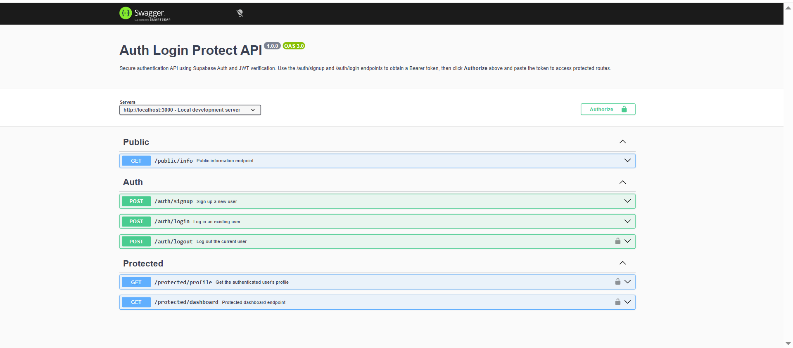

# Auth-Login-Protect API

A secure REST API that handles user authentication (Sign Up, Log In, Log Out) and protects specific routes using **Supabase Auth** and **JWT verification**.

Built with Node.js and Express, this project demonstrates the modern "trust triangle" authentication pattern: **Client → Identity Provider (Supabase) → Backend Server**.

## Tech Stack

| Tool | Purpose |
|------|---------|
| [Node.js](https://nodejs.org/) | JavaScript runtime |
| [Express 5](https://expressjs.com/) | Web framework |
| [Supabase Auth](https://supabase.com/auth) | Identity Provider — manages users, passwords, and JWT issuance |
| [swagger-jsdoc](https://www.npmjs.com/package/swagger-jsdoc) + [swagger-ui-express](https://www.npmjs.com/package/swagger-ui-express) | Auto-generated API documentation |
| [dotenv](https://www.npmjs.com/package/dotenv) | Environment variable management |

## Quick Start (< 5 minutes)

### 1. Clone the repository

```bash
git clone https://github.com/meerqamar/Auth-Login-protect.git
cd Auth-Login-protect
```

### 2. Install dependencies

```bash
npm install
```

### 3. Set up environment variables

Copy the example file and fill in your Supabase credentials:

```bash
cp .env.example .env
```

Open `.env` and replace the placeholder values:

```env
SUPABASE_URL=https://your-project-ref.supabase.co
SUPABASE_KEY=your-anon-key-here
PORT=3000
```

> **Where to find these values:**
> 1. Log in to [supabase.com/dashboard](https://supabase.com/dashboard)
> 2. Select your project
> 3. Go to **Project Settings → API**
> 4. Copy the **Project URL** and **anon (public)** key

> **Tip:** Disable email confirmations in **Authentication → Settings** for easier testing.

### 4. Start the server

```bash
npm start
```

You should see:

```
Server running and connected to Supabase on port 3000
```

### 5. Open Swagger UI

Navigate to **[http://localhost:3000/docs](http://localhost:3000/docs)** to explore and test all endpoints interactively.

## API Reference

| Method | Endpoint | Auth Required | Description |
|--------|----------|:------------:|-------------|
| `GET` | `/public/info` | No | Returns publicly available data |
| `POST` | `/auth/signup` | No | Creates a new user account via Supabase |
| `POST` | `/auth/login` | No | Authenticates user and returns a JWT access token |
| `POST` | `/auth/logout` | Bearer | Terminates user session (returns 204 No Content) |
| `GET` | `/protected/profile` | Bearer | Returns authenticated user's profile data |
| `GET` | `/protected/dashboard` | Bearer | Returns authenticated user's dashboard data |

### Authentication Flow

```
┌──────────┐         ┌──────────────┐         ┌──────────┐
│  Client  │──POST──▶│  /auth/login │──SDK───▶│ Supabase │
│          │         │  (Server)    │         │  Auth    │
│          │◀─token──│              │◀─JWT────│          │
│          │         └──────────────┘         └──────────┘
│          │
│          │         ┌──────────────────┐
│          │──GET───▶│ /protected/      │
│  Bearer  │         │  profile         │
│  token   │         │                  │
│  header  │◀─data───│ verifyToken()    │
│          │         │ middleware checks│
└──────────┘         └──────────────────┘
```

1. **Sign Up / Log In** → Send `email` + `password` → Supabase validates → Returns JWT
2. **Protected Request** → Attach `Authorization: Bearer <token>` header → Server middleware verifies via Supabase → Returns protected data
3. **Log Out** → Server verifies token → Returns 204 → Client discards token

## Swagger UI



The Swagger UI at `/docs` provides:
- **Authorize button** — Paste your JWT to test protected endpoints
- **Try it out** — Execute requests directly from the browser
- **Grouped endpoints** — Organized into Public, Auth, and Protected sections

## Testing

### Via Swagger UI

1. `POST /auth/signup` — Create a user with email + password
2. `POST /auth/login` — Log in and copy the `access_token` from the response
3. Click **Authorize** → Paste the token → Click **Authorize**
4. `GET /protected/profile` — Should return your user data
5. `GET /protected/dashboard` — Should return dashboard data
6. `GET /public/info` — Works without authentication
7. `POST /auth/logout` — Returns 204 No Content

### Via curl

```bash
# Public endpoint (no auth needed)
curl -i http://localhost:3000/public/info

# Sign up
curl -X POST http://localhost:3000/auth/signup \
  -H "Content-Type: application/json" \
  -d '{"email":"test@example.com","password":"SecurePass123!"}'

# Log in (copy the access_token from response)
curl -X POST http://localhost:3000/auth/login \
  -H "Content-Type: application/json" \
  -d '{"email":"test@example.com","password":"SecurePass123!"}'

# Protected endpoint (replace <TOKEN> with your access_token)
curl -i http://localhost:3000/protected/profile \
  -H "Authorization: Bearer <TOKEN>"

# Logout
curl -X POST http://localhost:3000/auth/logout \
  -H "Authorization: Bearer <TOKEN>"
```

### Via automated tests

```bash
# Start the server in one terminal
npm start

# Run tests in another terminal
npm test
```

## Project Structure

```
Auth-Login-Protect/
├── server.js            # Main server — routes, middleware, Swagger config
├── test/
│   └── auth.test.js     # Automated endpoint tests
├── .env                 # Environment variables (git-ignored)
├── .env.example         # Template for environment variables
├── .gitignore           # Excludes .env and node_modules
├── swagger-ui-screenshot.png
├── package.json         # Dependencies and scripts
└── README.md            # This file
```

## Security Notes

- **`.env` is git-ignored** — Supabase keys are never committed to version control
- **Passwords are never stored locally** — Supabase handles all password hashing and storage
- **JWTs are verified server-side** — Every protected route validates the token via Supabase's `getUser()` API
- **Reusable middleware** — `verifyToken` middleware is applied to all protected routes consistently

## License

ISC
